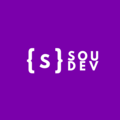
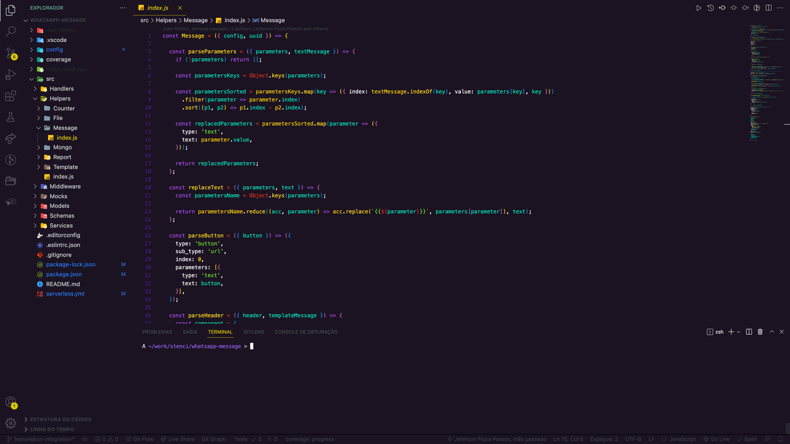
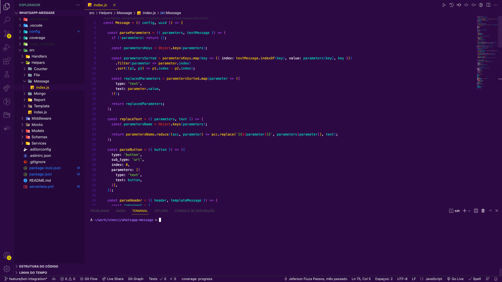
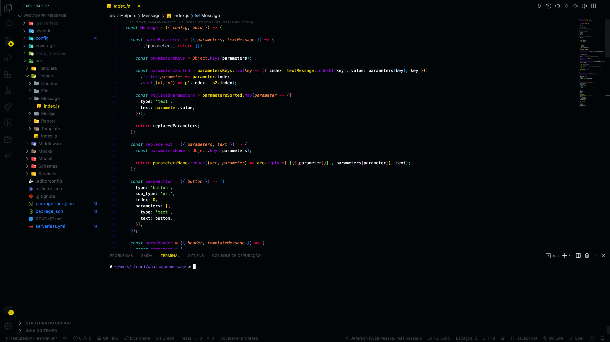
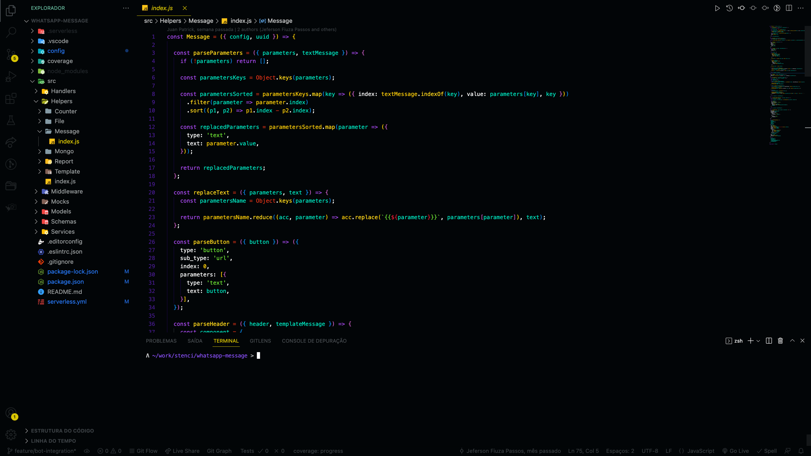

  
      

> **NOTE**: This theme includes a variant with italic keywords that looks great with fonts like Operator Mono or Catograph Mono

inspired by the https://github.com/EliverLara/Andromeda